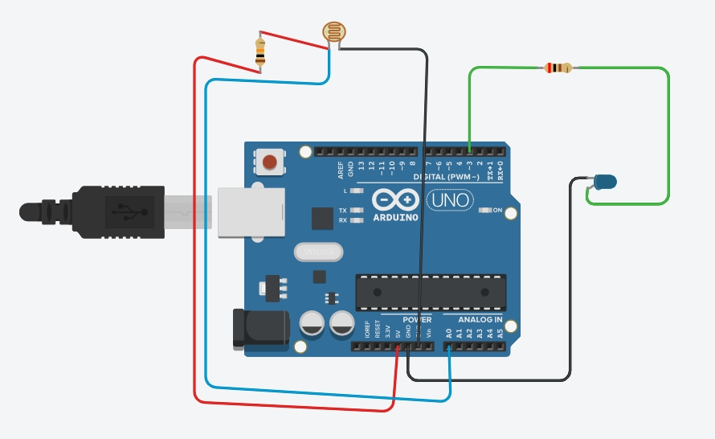

เป็นการทดสอบการใช้งาน PID เบื้องต้น
ในที่นี้ใช้เฉพาะ Kp และ Ki เท่านั้น ยังไม่มีการใช้ Kd

ให้เริ่มต้นทดสอบจาก Kp ก่อนจากนั้นค่อยๆเพิ่มจน ค่าเข้าสู่ SETPOINT 
เมื่อเกิด steady state แล้ว ให้ลองเพิ่มค่า Ki

  

